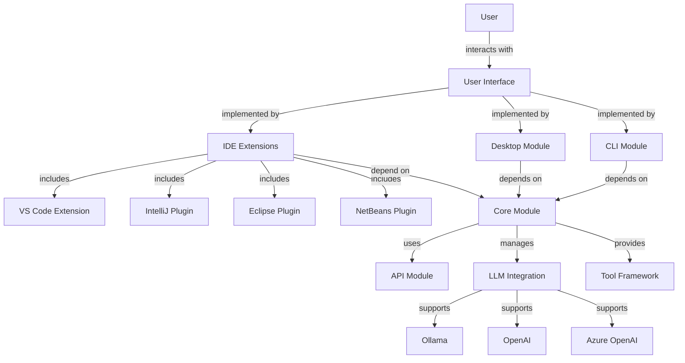
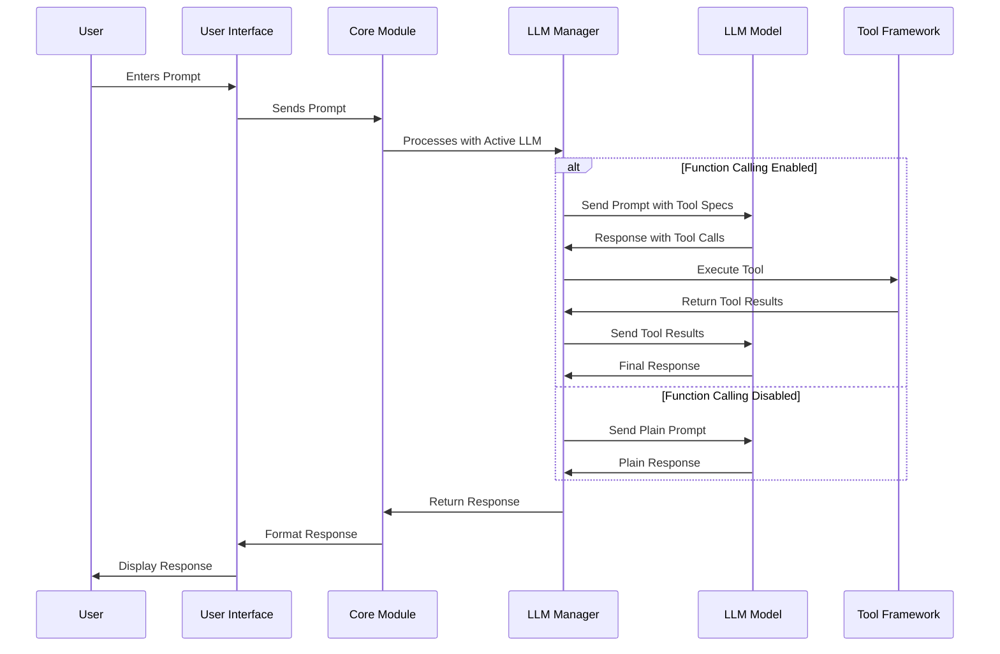
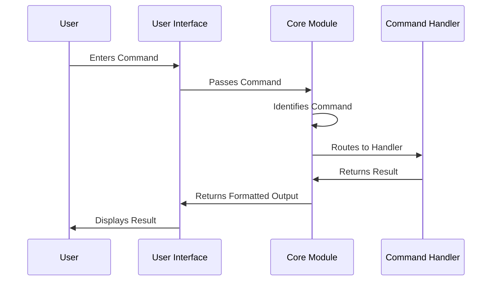
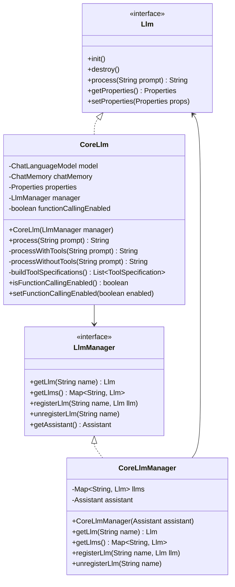
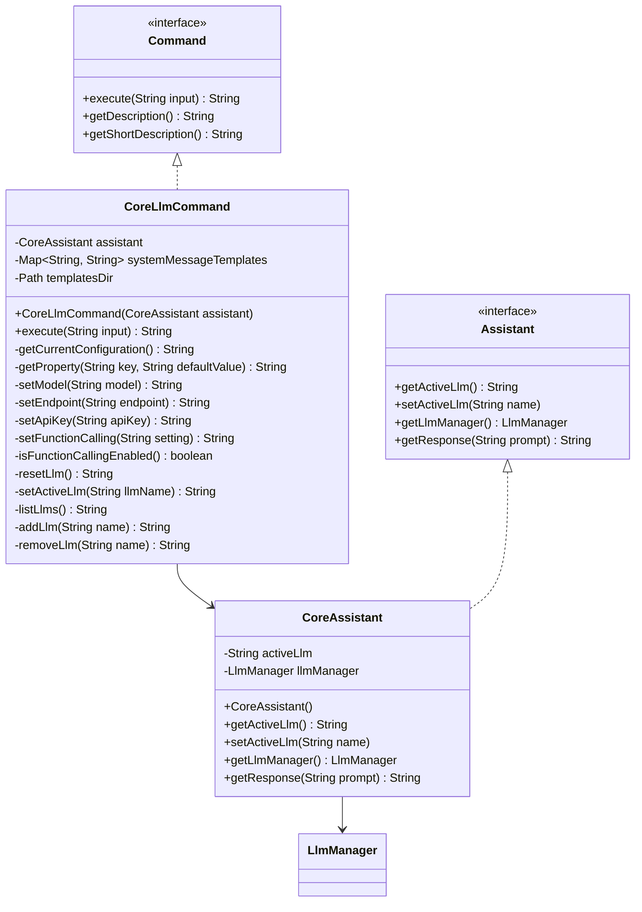
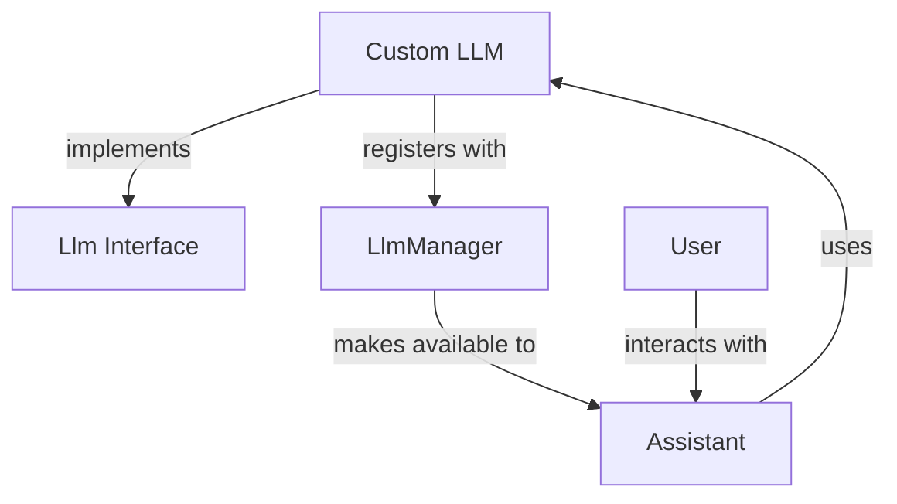

# Manorrock Assistant Documentation

> **Note:** This documentation was generated with the assistance of AI tools and represents our understanding of the project at the time of writing. While we strive for accuracy, some sections may describe aspirational functionality or contain unintentional inaccuracies. Manorrock Assistant is an open-source project, and we welcome contributions from the community to improve both the software and its documentation. If you find errors or wish to enhance these materials, please consider submitting a pull request.

> **Disclaimer:** This software is provided "as is", without warranty of any kind, express or implied, including but not limited to the warranties of merchantability, fitness for a particular purpose and noninfringement. In no event shall the authors or copyright holders be liable for any claim, damages or other liability, whether in an action of contract, tort or otherwise, arising from, out of or in connection with the software or the use or other dealings in the software. See the [LICENSE](../LICENSE) file for complete terms.

## Project Overview

Manorrock Assistant is a versatile platform that exposes Large Language Models through a chat-like interface across various environments. The project was initially developed using AI assistance as a proof of concept to explore the potential of AI-assisted development.

## Project Architecture

The project follows a modular architecture with clear separation of concerns. The following diagram illustrates the high-level architecture:

## Module Structure

Manorrock Assistant is organized into the following key modules:

| Module | Description |
|--------|-------------|
| [api](/docs/api/README.md) | Core API interfaces and classes that define the contract between components |
| [core](/docs/core/README.md) | Core implementation providing the central business logic and orchestration |
| [cli](/docs/cli/README.md) | Command-line interface implementation |
| [desktop](/docs/desktop/README.md) | Desktop application implementation |
| [eclipse](/docs/eclipse/README.md) | Eclipse plugin implementation |
| [intellij](/docs/intellij/README.md) | IntelliJ IDEA plugin implementation |
| [mobile](/docs/mobile/README.md) | Mobile application implementation |
| [netbeans](/docs/netbeans/README.md) | NetBeans IDE plugin implementation |
| [vscode](/docs/vscode/README.md) | Visual Studio Code extension implementation |
| [mobile](/docs/mobile/README.md) | Mobile application implementation |
| [netbeans](/docs/netbeans/README.md) | NetBeans IDE plugin implementation |
| [vscode](/docs/vscode/README.md) | Visual Studio Code extension implementation |

## Workflow Diagrams

### LLM Processing Workflow

### Command Processing Workflow

## Component Architecture

### LLM Integration

### Command System

## Extension Points

Manorrock Assistant provides several extension points for developers who wish to enhance or customize its functionality:

1. **LLM Integration**: Implement the `Llm` interface to add support for new Large Language Models.
2. **Command System**: Implement the `Command` interface to add new commands.
3. **Tool Framework**: Implement the `Tool` interface to add new capabilities for LLMs.

### LLM Extension Example

## Developer's Guide

See the dedicated guides for developers who want to extend or contribute to Manorrock Assistant:

- [Building from Source](/docs/development/building.md)
- [Adding a New LLM](/docs/development/adding-llm.md)
- [Implementing a New Command](/docs/development/adding-command.md)
- [Creating Custom Tools](/docs/development/developer-guide.md#3-tool-framework)
- [IDE Integration](/docs/development/ide-integration.md)

## User's Guide

- [Installation](/docs/user/installation.md)
- [Getting Started](/docs/user/getting-started.md)
- [Command Reference](/docs/user/command-reference.md)
- [Configuration](/docs/user/configuration.md)
- [Using LLMs](/docs/user/using-llms.md)
