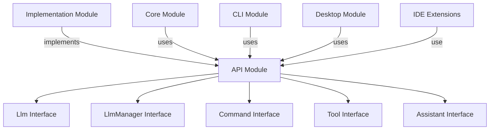
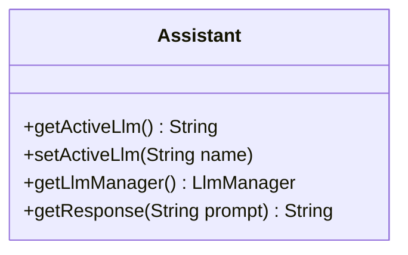
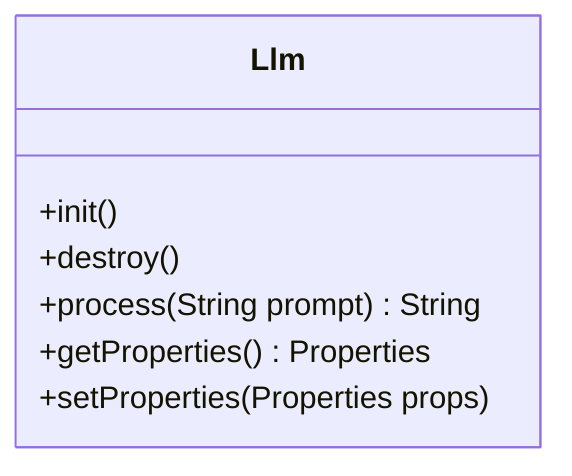
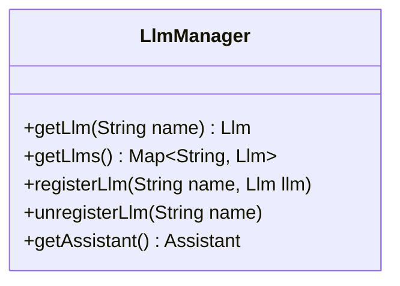
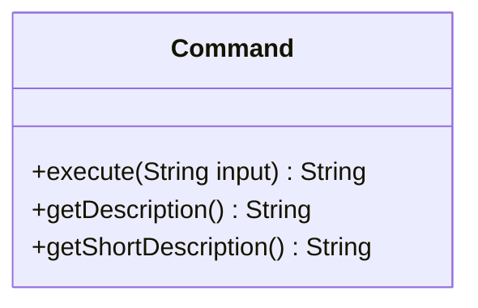
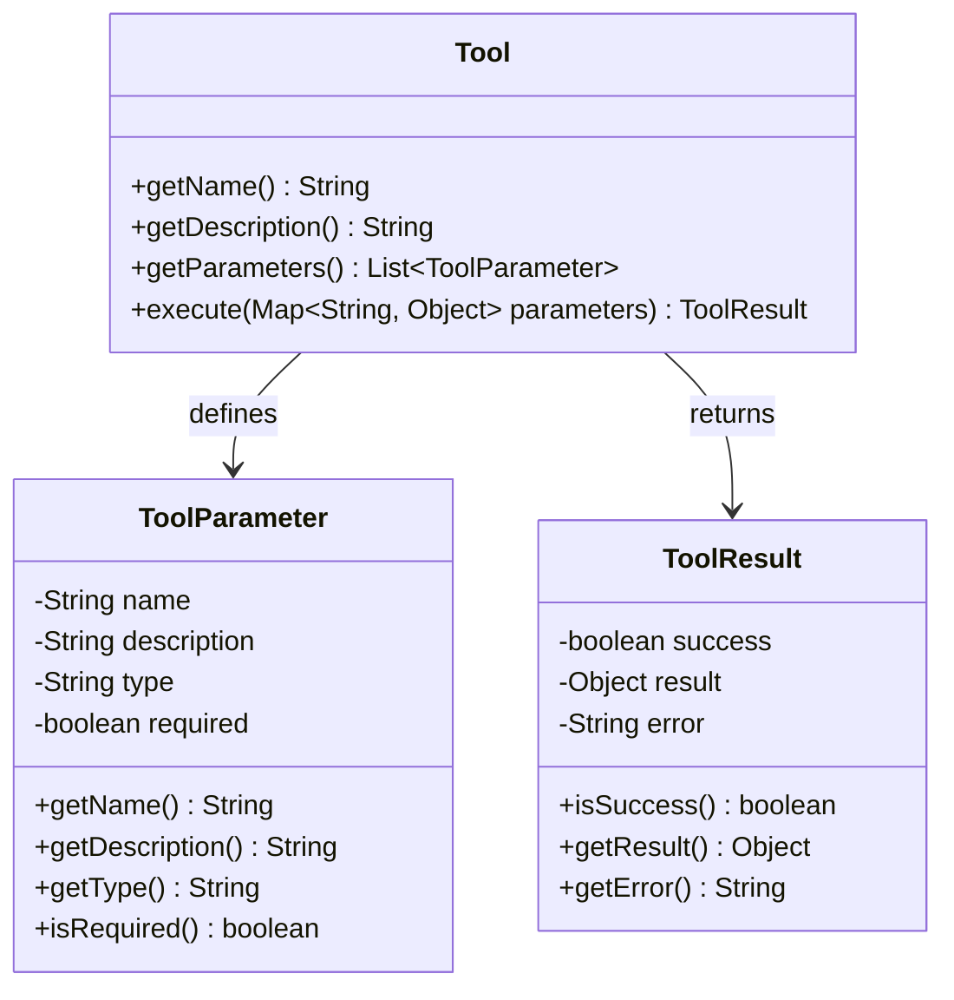
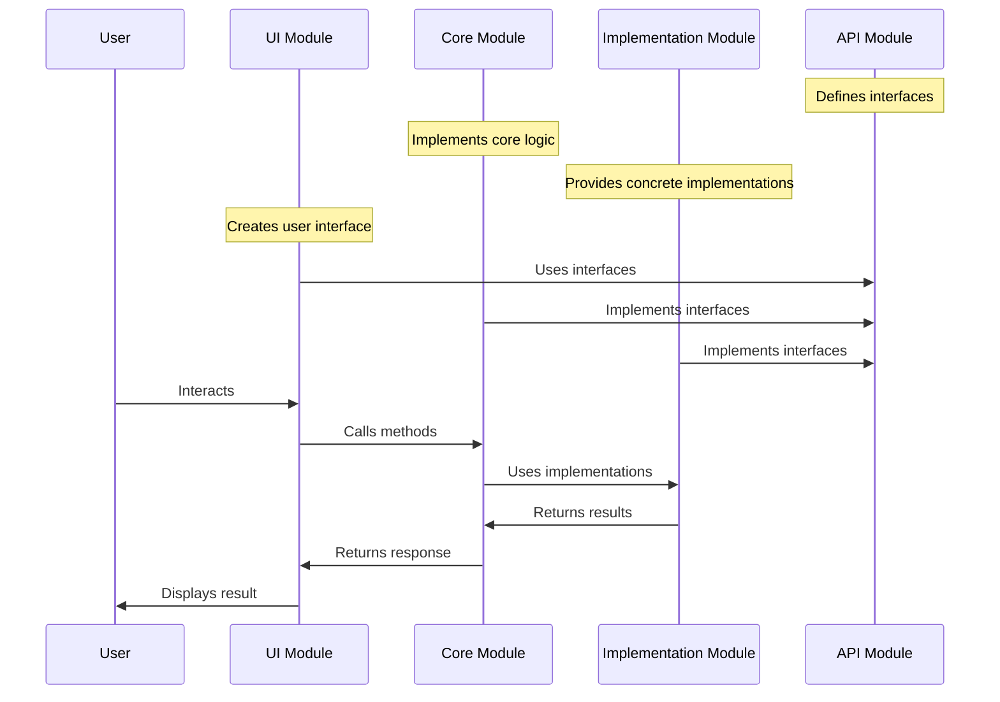

# API Module

The API module defines the core interfaces and classes that establish the contract between different components of the Manorrock Assistant system. It's a lightweight module with minimal dependencies that serves as the foundation for the entire system.

## Overview

The API module provides the abstract interfaces that define:

- How LLMs (Large Language Models) are managed and accessed
- How commands are structured and executed
- How tools are defined and used by LLMs
- How the assistant as a whole should behave



## Key Interfaces

### Assistant Interface

The `Assistant` interface defines the central contract for the assistant. It serves as the main entry point for user interactions and handles both direct queries and commands.



Methods:
- `getActiveLlm()`: Returns the name of the currently active LLM
- `setActiveLlm(String name)`: Sets the active LLM by name
- `getLlmManager()`: Returns the LLM manager handling available LLMs
- `getResponse(String prompt)`: Processes a prompt and returns a response

### Llm Interface

The `Llm` interface defines the contract for integrating with Large Language Models. It abstracts away the details of specific LLM implementations and provides a unified interface for working with different LLMs.



Methods:
- `init()`: Initializes the LLM with its configuration
- `destroy()`: Cleans up resources when the LLM is no longer needed
- `process(String prompt)`: Processes a prompt and returns the LLM's response
- `getProperties()`: Returns the properties used to configure the LLM
- `setProperties(Properties props)`: Sets configuration properties for the LLM

### LlmManager Interface

The `LlmManager` interface defines how LLMs are managed within the system. It provides methods for registering, unregistering, and retrieving LLMs.



Methods:
- `getLlm(String name)`: Retrieves an LLM by name
- `getLlms()`: Returns a map of all registered LLMs
- `registerLlm(String name, Llm llm)`: Registers an LLM with a given name
- `unregisterLlm(String name)`: Unregisters an LLM by name
- `getAssistant()`: Returns the associated assistant instance

### Command Interface

The `Command` interface defines the contract for commands that can be executed by the assistant. Commands provide a way to extend the functionality of the assistant beyond simple LLM interactions.



Methods:
- `execute(String input)`: Executes the command with the given input and returns the result
- `getDescription()`: Returns a detailed description of the command including usage instructions
- `getShortDescription()`: Returns a brief description of the command's purpose

### Tool Interface

The `Tool` interface defines the contract for tools that can be used by LLMs. Tools allow LLMs to interact with external systems and perform actions that wouldn't be possible with text generation alone.



Methods:
- `getName()`: Returns the unique name of the tool
- `getDescription()`: Returns a description of what the tool does
- `getParameters()`: Returns a list of parameters the tool accepts
- `execute(Map<String, Object> parameters)`: Executes the tool with the given parameters and returns the result

## Dependency Relationships

The API module defines interfaces that are implemented by various other modules:

1. **Core Module**: Implements the primary interfaces (Assistant, LlmManager, Command) with the core functionality
2. **Implementation Module**: Provides concrete implementations of the interfaces for different platforms and LLMs
3. **UI Modules** (CLI, Desktop, IDE extensions): Consume the interfaces to provide user-facing functionality



## Extending with the API

The API module is designed to be extended by implementing its interfaces. Here are some examples of how you might extend the system using the API interfaces:

### Implementing a Custom LLM

```java
public class CustomLlm implements Llm {
    private Properties properties = new Properties();
    private CustomLanguageModel model;
    
    @Override
    public void init() {
        // Initialize with configuration from properties
        String apiKey = properties.getProperty("apiKey");
        String modelName = properties.getProperty("modelName");
        model = new CustomLanguageModel(apiKey, modelName);
    }
    
    @Override
    public void destroy() {
        // Clean up resources
        model = null;
    }
    
    @Override
    public String process(String prompt) {
        // Process the prompt using the custom model
        return model.generateResponse(prompt);
    }
    
    @Override
    public Properties getProperties() {
        return properties;
    }
    
    @Override
    public void setProperties(Properties props) {
        this.properties = props;
    }
}
```

### Implementing a Custom Command

```java
public class WeatherCommand implements Command {
    @Override
    public String execute(String input) {
        // Parse location from input
        String location = parseLocation(input);
        
        // Fetch weather data for the location
        WeatherData data = fetchWeatherData(location);
        
        // Format and return the weather information
        return formatWeatherInfo(data);
    }
    
    @Override
    public String getDescription() {
        return "Gets weather information for a location.\n\n" +
               "Usage:\n" +
               "  /weather <location>   - Get current weather for the specified location";
    }
    
    @Override
    public String getShortDescription() {
        return "Gets weather information";
    }
    
    // Helper methods
    private String parseLocation(String input) { /* ... */ }
    private WeatherData fetchWeatherData(String location) { /* ... */ }
    private String formatWeatherInfo(WeatherData data) { /* ... */ }
}
```

### Implementing a Custom Tool

```java
public class CalculatorTool implements Tool {
    @Override
    public String getName() {
        return "calculator";
    }
    
    @Override
    public String getDescription() {
        return "Performs mathematical calculations";
    }
    
    @Override
    public List<ToolParameter> getParameters() {
        return Arrays.asList(
            new ToolParameter("expression", "Mathematical expression to evaluate", "string", true)
        );
    }
    
    @Override
    public ToolResult execute(Map<String, Object> parameters) {
        try {
            String expression = (String) parameters.get("expression");
            double result = evaluateExpression(expression);
            return new ToolResult(true, result, null);
        } catch (Exception e) {
            return new ToolResult(false, null, "Error: " + e.getMessage());
        }
    }
    
    // Helper method
    private double evaluateExpression(String expression) { /* ... */ }
}
```
