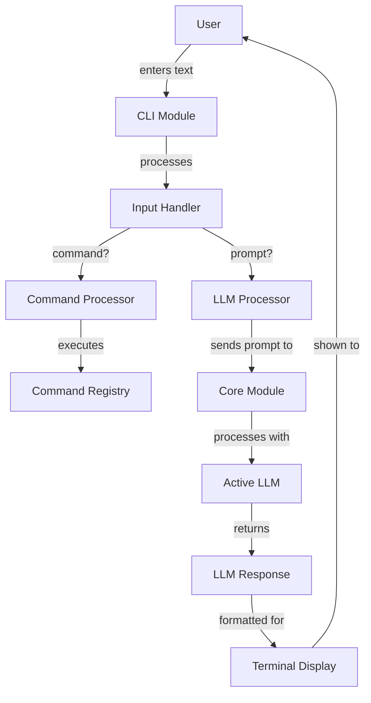
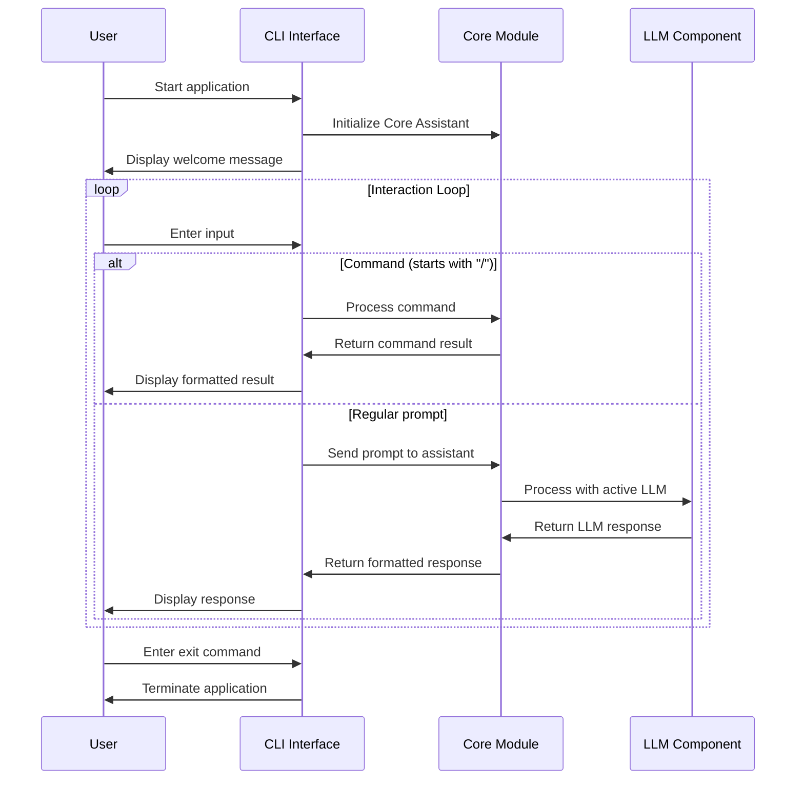
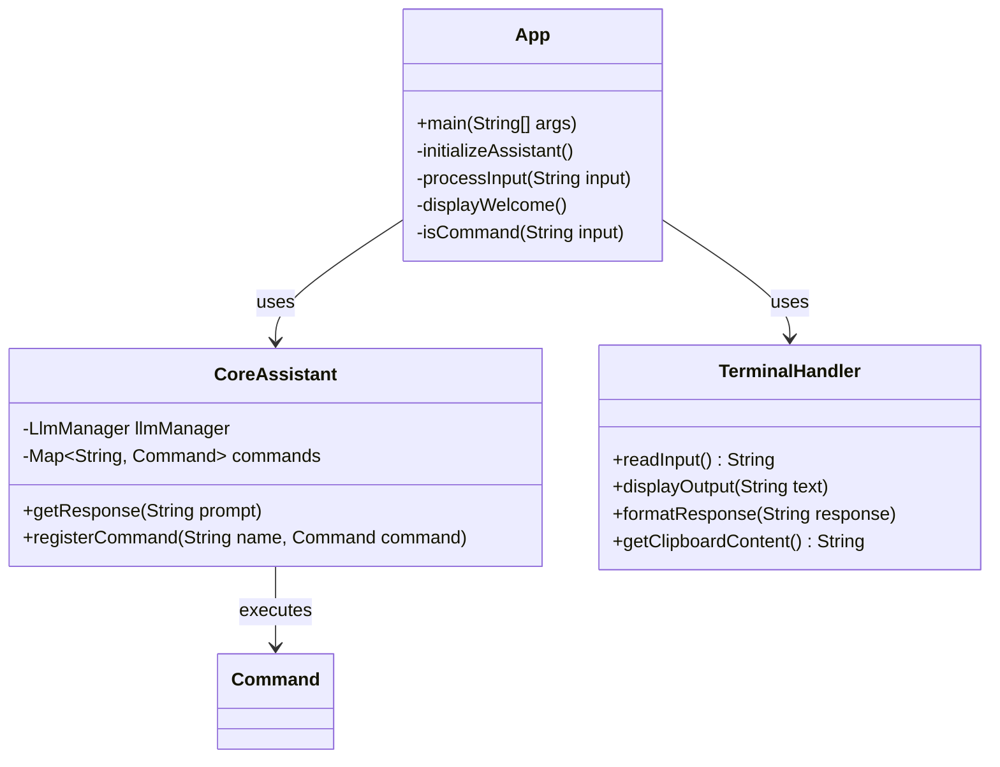

# CLI Module

The CLI (Command Line Interface) module provides a text-based interface for interacting with Manorrock Assistant. It allows users to access LLM capabilities and execute assistant commands directly from the terminal.

## Overview

The CLI module is a standalone Java application that:
- Provides a terminal-based user interface to Manorrock Assistant
- Processes user input and displays responses
- Handles command parsing and execution
- Supports ANSI terminal features for enhanced display



## Key Components

### CLI Application

The main application class that:
- Initializes the assistant
- Sets up the terminal environment
- Handles the main input/output loop
- Processes user commands and prompts

### Terminal Handler

Manages the terminal interface:
- Handles ANSI color codes for formatted output
- Processes keyboard input
- Supports command history navigation
- Manages clipboard integration for the `/explain` command

### Command Processor

Detects and routes commands:
- Identifies when input starts with `/` to trigger command handling
- Routes commands to appropriate handlers in the core module
- Formats and displays command results

## Usage Workflow



## Installation and Usage

### Quick Install

To install the latest stable release of Manorrock Assistant CLI:

```shell
/bin/bash -c "$(curl -fsSL https://raw.githubusercontent.com/manorrock/assistant/current/install.sh)"
```

### Running the CLI

Once installed, you can run the CLI:

```shell
manorrock-assistant
```

### Basic Commands

| Command | Description |
|---------|-------------|
| `/help` | Shows available commands |
| `/llm` | Manages LLMs and their configuration |
| `/ollama` | Manages Ollama models and server |
| `/session` | Manages chat sessions |
| `/context` | Manages context files for prompts |
| `/tool` | Manages and executes tools |

## Configuration

The CLI stores configuration in the user's home directory:

```
~/.manorrock/assistant/
  ├── config.properties  # General configuration
  ├── llms/              # LLM configurations
  ├── sessions/          # Chat session history
  ├── contexts/          # Context files
  └── templates/         # System message templates
```

## Clipboard Integration

The CLI supports clipboard integration for the `/explain` command:

- On macOS: Uses `pbpaste` to access clipboard content
- On Linux: Uses `xclip` or `xsel` (if available)
- On Windows: Uses native clipboard access

## Example Session

Below is an example of a typical CLI session:

```
$ manorrock-assistant
Welcome to Manorrock Assistant CLI!
Type your questions or use / commands (try /help)

> /llm list
Available LLMs:
  * default (OLLAMA, llama3.2)

Use '/llm set <name>' to set the active LLM

> /llm info
Current LLM Configuration:
  API Key: ********
  Endpoint: http://localhost:11434
  Function Calling: OFF
  Model: llama3.2
  Temperature: 0.7
  Vendor: OLLAMA

> Hello, who are you?
I am Manorrock Assistant, an AI assistant powered by the Llama model. I'm running 
locally on your machine through Ollama. I can help answer questions, assist with 
tasks, and provide information on a wide range of topics. How can I help you today?

> /session clear
Session cleared successfully.
```

## Development

### Building from Source

To build the CLI module from source:

```bash
cd cli
mvn clean package
```

This will create an executable JAR file in the `target` directory.

### Customizing the CLI

You can extend the CLI by:

1. Adding new commands by implementing the `Command` interface
2. Registering those commands with the CoreAssistant
3. Customizing the terminal display by extending the terminal handler

### Architecture Details



## Platform-Specific Features

The CLI adapts to different operating systems:

- **Color Support**: Uses ANSI escape codes on terminals that support them
- **Clipboard Access**: Uses platform-specific commands for clipboard integration
- **History Navigation**: Supports up/down arrow keys for history traversal on supported terminals

## Troubleshooting

### Common Issues

1. **Ollama Connection**: If you see connection errors, ensure Ollama is running (`ollama serve`)
2. **Memory Issues**: For large models, you may need to increase Java heap size (`java -Xmx4g -jar cli.jar`)
3. **Clipboard Access**: The `/explain` command requires clipboard utilities (varies by platform)

### Logs

The CLI logs information to:

```
~/.manorrock/assistant/logs/
```

Check these logs for troubleshooting connection issues or unexpected behavior.
