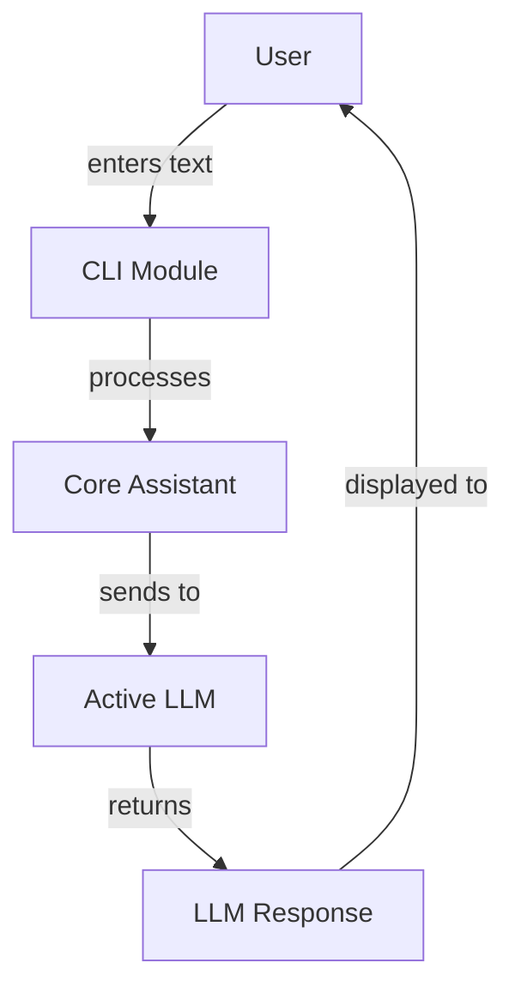

# CLI Module

The CLI (Command Line Interface) module provides a text-based interface for interacting with Manorrock Assistant. It allows users to access LLM capabilities and execute assistant commands directly from the terminal.

## Overview

The CLI module is a simple Java application that:
- Provides a terminal-based interface to Manorrock Assistant
- Processes user input and displays AI responses
- Supports both single-query and interactive modes
- Includes basic command functionality



## Key Components

### CLI Application

The main `CLI` class:
- Initializes the core assistant
- Processes command-line arguments
- Handles interactive mode
- Routes commands and messages

### Command Support

Currently supports:
- Command interface implementation
- `/explain` command for explaining clipboard or file content

## Usage Modes

The CLI supports different modes of operation:

1. **Single Query Mode**: Pass a message as a command-line argument
2. **Interactive Mode**: Start a conversation session with continuous input/output
3. **Stdin Mode**: Read input from standard input

## Installation and Usage

### Building from Source

To build the CLI module from source:

```bash
cd cli
mvn clean package
```

This will create the executable JAR file in the `target` directory.

### Running the CLI

Once built, you can run the CLI:

```shell
java -jar cli/target/cli.jar [options] [message]
```

### Command-line Options

| Option | Description |
|--------|-------------|
| `-i, --interactive` | Start in interactive mode |
| `--stdin` | Read message from standard input |
| `--no-banner` | Do not show the banner |
| `--no-prefix` | Do not show You/Assistant: prefix |
| `--debug` | Enable debug logging |
| `-h, --help` | Show help message |
| `-V, --version` | Show version information |

## Available Commands

Currently, the CLI implements the following commands:

| Command | Description |
|---------|-------------|
| `/explain clipboard` | Explains text from the clipboard |
| `/explain file <path>` | Explains text from the specified file |
| `/exit` | Exits the interactive mode |
| `/help` | Shows help information |

## Clipboard Integration

The `/explain clipboard` command supports platform-specific clipboard integration:

- On macOS: Uses `pbpaste` to access clipboard content
- On Linux: Uses `xclip` to access clipboard content
- On Windows: Uses PowerShell's `Get-Clipboard` command

## Example Session

Below is an example of a typical CLI session in interactive mode:

```
$ java -jar cli.jar -i
Entering interactive mode. Type /exit to quit, or /help for commands.
Use \ at end of line for multi-line input.

You: Hello, who are you?
Assistant: I'm an AI assistant powered by the Manorrock Assistant. I can help answer questions and provide information on a variety of topics. How can I assist you today?

You: /explain clipboard
Assistant: Original text:
public int add(int a, int b) {
    return a + b;
}

Explanation:
This is a Java method named "add" that takes two integer parameters (a and b) and returns their sum as an integer value.

You: /exit
Exiting interactive mode.
```

## Multi-line Input

In interactive mode, you can enter multi-line input by ending a line with a backslash `\`:

```
You: Tell me about \
... Java programming \
... in three bullet points.
```

## Development

### Extending the CLI

You can extend the CLI by:

1. Creating new command classes that implement the `Command` interface
2. Registering commands with the CoreAssistant in the CLI constructor

Example of implementing a custom command:

```java
public class CustomCommand implements Command {
    @Override
    public String execute(String input) {
        // Command implementation
    }
    
    @Override
    public String getDescription() {
        return "Description of the command";
    }
    
    @Override
    public String getShortDescription() {
        return "Short description";
    }
}
```

## Troubleshooting

### Debug Logging

To enable debug logging, use the `--debug` flag:

```shell
java -jar cli.jar --debug
```

### Clipboard Issues

If the `/explain clipboard` command fails:
- On macOS: Ensure `pbpaste` is available
- On Linux: Install `xclip` package
- On Windows: Ensure PowerShell is available and can run `Get-Clipboard`
