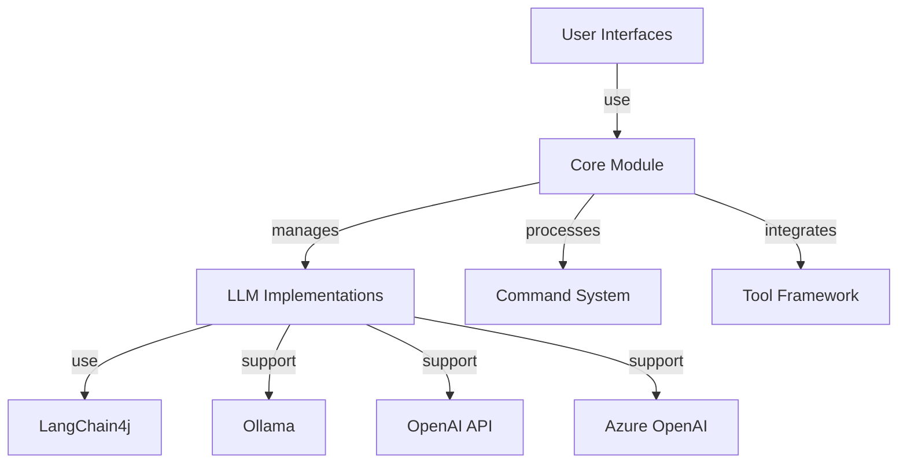
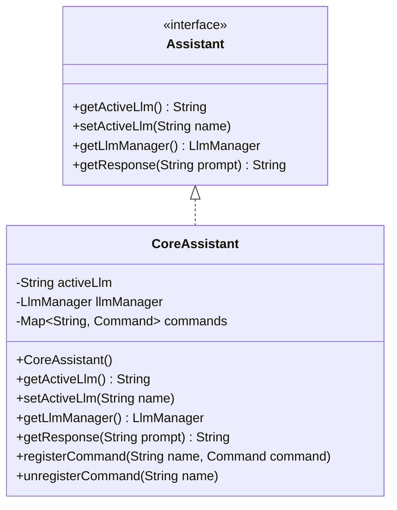
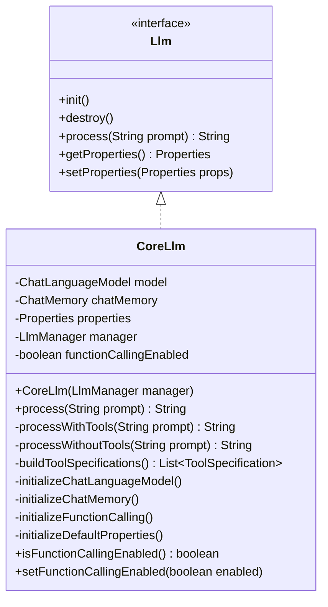
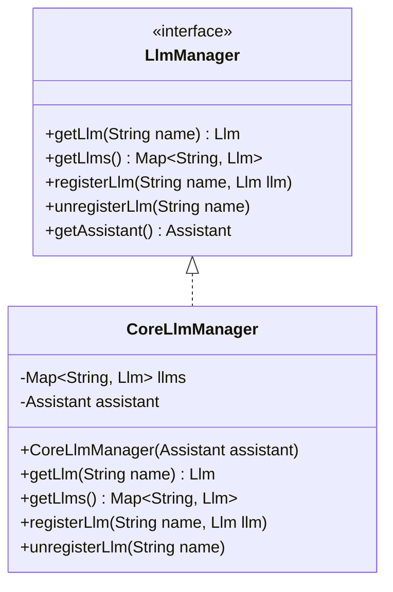
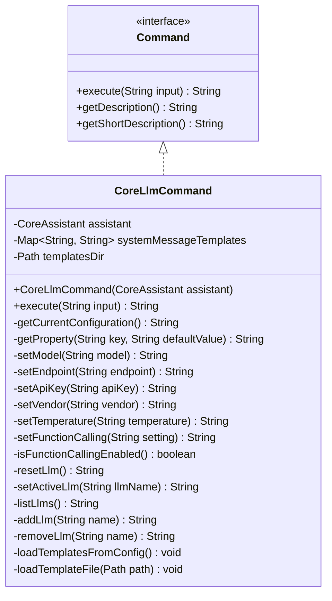
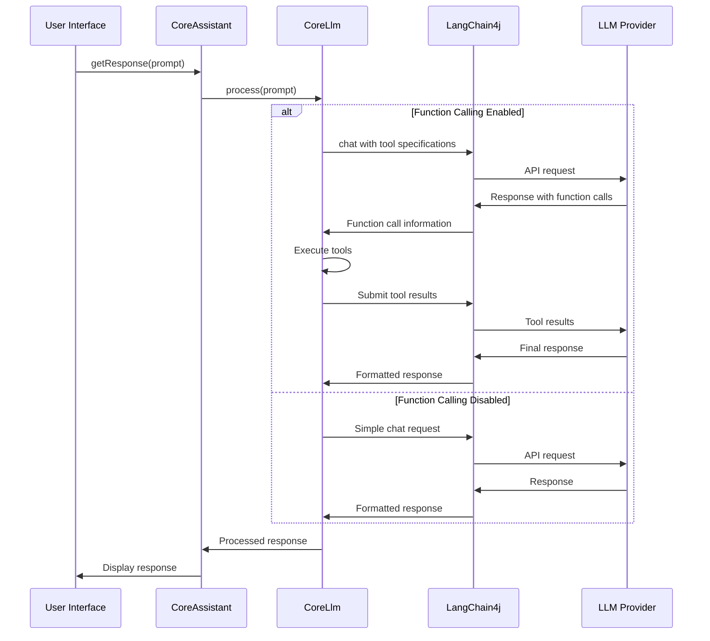

# Core Module

The Core Module is the central component of the Manorrock Assistant system, providing the business logic for managing Large Language Models (LLMs), handling commands, and orchestrating the overall assistant functionality.

## Overview

The Core Module serves as the bridge between the user interfaces (CLI, Desktop, and IDE plugins) and the underlying LLM implementations. It handles:

- LLM management and configuration
- Command processing
- Tool integration for function calling with LLMs
- Template management for system prompts



## Key Components

### CoreAssistant

The `CoreAssistant` class implements the `Assistant` interface and serves as the main entry point for all user interactions. It:

- Manages the active LLM selection
- Processes user prompts and commands
- Routes command execution to appropriate handlers



### CoreLlm

The `CoreLlm` class implements the `Llm` interface and provides the core LLM functionality:

- Integration with LangChain4j for different LLM providers
- Support for streaming responses
- Tool integration through function calling
- Chat memory management for context retention



### CoreLlmManager

The `CoreLlmManager` class implements the `LlmManager` interface and is responsible for:

- Registering and unregistering LLMs
- Providing access to available LLMs
- Managing LLM lifecycle (initialization and destruction)



### CoreLlmCommand

The `CoreLlmCommand` class implements the `Command` interface and provides the `/llm` command functionality:

- Managing LLM configuration
- Switching between LLMs
- Setting templates for system prompts
- Enabling/disabling function calling



## LLM Integration

The Core Module integrates with different LLM providers through LangChain4j. It supports:

1. **Ollama** - Local LLM hosting (default)
2. **OpenAI** - Cloud-based LLM service
3. **Azure OpenAI** - Microsoft's cloud-based LLM service

### Workflow



## System Message Templates

The Core Module manages system message templates that can be applied to customize the behavior of the LLM. Templates are stored as JSON files in the user's configuration directory and can be selected using the `/llm systemMessage` command. 

Built-in templates include:
- Default assistant
- Code reviewer
- Design pattern expert
- Performance optimizer
- Security analyst

## Configuration

The Core Module handles the configuration of LLMs through properties:

| Property | Description | Default Value |
|----------|-------------|---------------|
| baseUrl | LLM API endpoint URL | http://localhost:11434 |
| modelName | Name of the LLM model | llama3.2 |
| apiKey | API key for authentication | (empty) |
| vendor | LLM vendor (OLLAMA, OPENAI, AZURE_OPENAI) | ollama |
| temperature | Response randomness (0.0-1.0) | 0.7 |
| maxMessages | Maximum message history | 10 |
| systemMessage | System prompt template | You are a helpful assistant. |
| functionCalling | Enable/disable function calling | false |
| timeout | Request timeout in seconds | 30 |

## Extending the Core Module

### Implementing a Custom LLM

To add a new LLM implementation, you can:

1. Implement the `Llm` interface
2. Register the implementation with `CoreLlmManager`

```java
// Create a custom LLM implementation
public class CustomLlm implements Llm {
    // Implement required methods...
}

// Register with the LLM manager
CoreLlmManager manager = assistant.getLlmManager();
manager.registerLlm("custom-llm", new CustomLlm());
```

### Adding a New Command

To add a new command to the assistant:

1. Implement the `Command` interface
2. Register the command with `CoreAssistant`

```java
// Create a custom command
public class CustomCommand implements Command {
    @Override
    public String execute(String input) {
        // Implementation...
    }
    
    @Override
    public String getDescription() {
        return "Detailed help message for the command";
    }
    
    @Override
    public String getShortDescription() {
        return "Short command description";
    }
}

// Register with the assistant
CoreAssistant assistant = new CoreAssistant();
assistant.registerCommand("custom", new CustomCommand());
```
