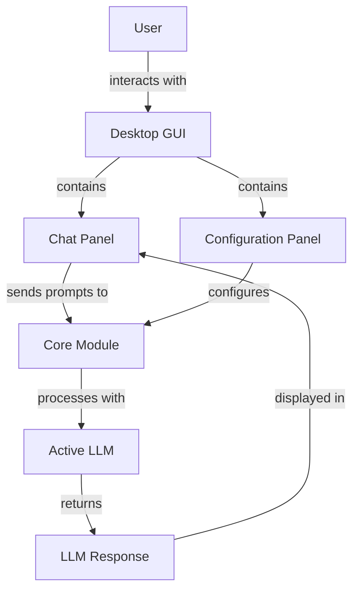
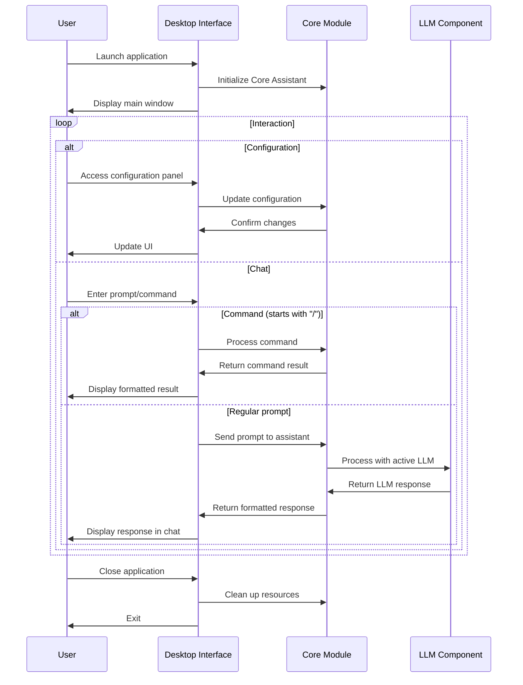
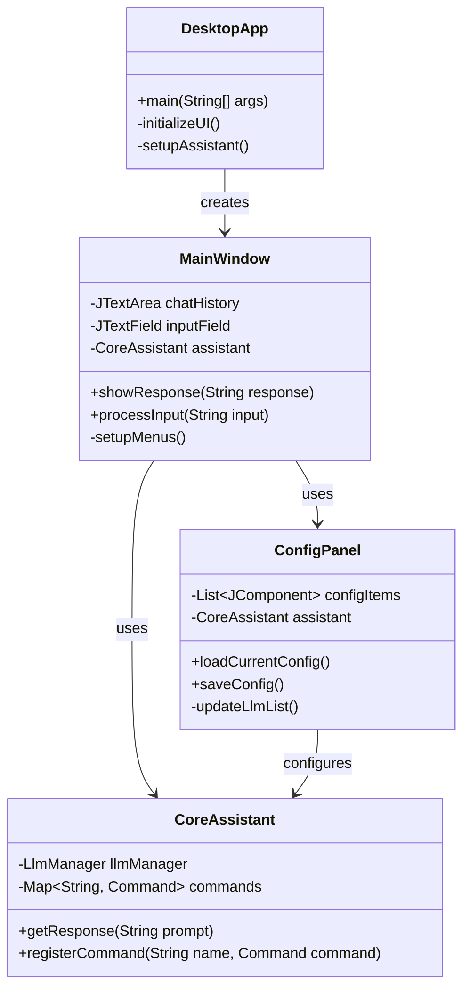

# Desktop Module

The Desktop module provides a graphical user interface for Manorrock Assistant, allowing users to interact with LLMs through a desktop application rather than a command line interface.

## Overview

The Desktop module is a Java application that:
- Provides a windowed graphical interface to Manorrock Assistant
- Supports rich text formatting for responses
- Offers a more visual way to configure and interact with LLMs
- Maintains the same command structure as the CLI for consistency



## Key Components

### Main Application Window

The main desktop application window provides:
- A chat interface for interacting with the assistant
- Menus for accessing configuration options
- Status indicators showing the active LLM
- Session management controls

### Chat Interface

The central component of the desktop interface:
- Displays conversation history with the assistant
- Provides a text input area for entering prompts
- Supports rich text formatting for responses
- Enables copying/pasting of content

### Configuration Panel

Provides graphical access to configuration options:
- LLM selection and configuration
- System message template selection
- Tool management and configuration
- Session management

## Usage Workflow



## Installation and Usage

### Download and Run

The Desktop application is distributed as a Java JAR file:

1. Download the latest release from the [GitHub releases page](https://github.com/manorrock/assistant/releases/latest)
2. Ensure you have Java 17 or later installed
3. Double-click the JAR file or run:
   ```
   java -jar manorrock-assistant-desktop.jar
   ```

### System Requirements

- Java Runtime Environment (JRE) 17 or later
- 2GB RAM minimum (4GB recommended for larger LLMs)
- Operating Systems:
  - Windows 10/11
  - macOS 11+
  - Linux with Gtk3

## User Interface

### Main Window Layout

```
┌─────────────────────────────────────────────────┐
│ Menu Bar (File, Edit, View, Help)               │
├─────────────────────────────────────────────────┤
│ ┌─────────────────────────────────────────────┐ │
│ │                                             │ │
│ │                                             │ │
│ │            Conversation History             │ │
│ │                                             │ │
│ │                                             │ │
│ └─────────────────────────────────────────────┘ │
│ ┌─────────────────────────────────────────────┐ │
│ │ Input: [                               ] ▶  │ │
│ └─────────────────────────────────────────────┘ │
│ Status Bar: Connected to llama3.2 (local)       │
└─────────────────────────────────────────────────┘
```

### Configuration Dialog

```
┌─────────────────────────────────────────────────┐
│ LLM Configuration                          [X]  │
├─────────────────────────────────────────────────┤
│ Active LLM: [dropdown] ▼                        │
│                                                 │
│ ┌─────────────────────┐ ┌─────────────────────┐ │
│ │ General             │ │ Add    │ Remove     │ │
│ │ ┌─────────────────┐ │ └─────────────────────┘ │
│ │ │ Vendor:         │ │                         │
│ │ │ [dropdown] ▼    │ │                         │
│ │ │                 │ │                         │
│ │ │ Model:          │ │                         │
│ │ │ [text field]    │ │                         │
│ │ │                 │ │                         │
│ │ │ API Key:        │ │                         │
│ │ │ [password field]│ │                         │
│ │ │                 │ │                         │
│ │ │ Temperature:    │ │                         │
│ │ │ [slider] [0.7]  │ │                         │
│ │ └─────────────────┘ │                         │
│ └─────────────────────┘                         │
│                                                 │
│ ┌─────────────────────────────────────────────┐ │
│ │ System Message Template                     │ │
│ │ [dropdown] ▼                                │ │
│ └─────────────────────────────────────────────┘ │
│                                                 │
│                  [Cancel] [Save]                │
└─────────────────────────────────────────────────┘
```

## Features

### Rich Text Formatting

The Desktop module supports rich text formatting for responses:
- Syntax highlighting for code blocks
- Markdown rendering for structured text
- Hyperlinks for URLs
- Font styling for emphasis

### Session Management

Users can:
- Save and load conversation sessions
- Export conversations to text or markdown
- Clear the conversation history
- Start new sessions with different LLMs

### System Tray Integration

The application can minimize to the system tray:
- Provides quick access to the assistant
- Shows notification indicators for important messages
- Allows for background operation

## Configuration

Like the CLI, the Desktop module stores configuration in the user's home directory:

```
~/.manorrock/assistant/
  ├── config.properties  # General configuration
  ├── llms/              # LLM configurations
  ├── sessions/          # Chat session history
  ├── contexts/          # Context files
  └── templates/         # System message templates
```

## Customization

### Themes

The Desktop application supports different visual themes:
- Light mode (default)
- Dark mode
- System theme (follows OS settings where supported)

### Keyboard Shortcuts

Common operations have keyboard shortcuts:
- Ctrl+Enter / Cmd+Enter: Send prompt
- Ctrl+N / Cmd+N: New session
- Ctrl+S / Cmd+S: Save session
- Ctrl+O / Cmd+O: Open session
- Ctrl+, / Cmd+,: Open settings

## Development

### Building from Source

To build the Desktop module from source:

```bash
cd desktop
mvn clean package
```

This will create an executable JAR file in the `target` directory named `manorrock-assistant-desktop.jar`.

### Architecture Details



## Platform-Specific Features

The Desktop application adapts to different operating systems:

- **Windows**: Uses native file dialogs and system tray integration
- **macOS**: Provides native menu bar integration and native look and feel
- **Linux**: Adapts to the desktop environment (GNOME, KDE, etc.)

## Troubleshooting

### Common Issues

1. **Java Version**: Ensure you're using Java 17 or later
2. **Display Scaling**: On high DPI displays, use the `-Dsun.java2d.uiScale=1.5` JVM option if text appears too small
3. **Performance**: For larger LLMs, allocate more memory with `-Xmx4g`

### Logs

The Desktop module logs information to:

```
~/.manorrock/assistant/logs/
```

Check these logs for troubleshooting UI issues or unexpected behavior.
