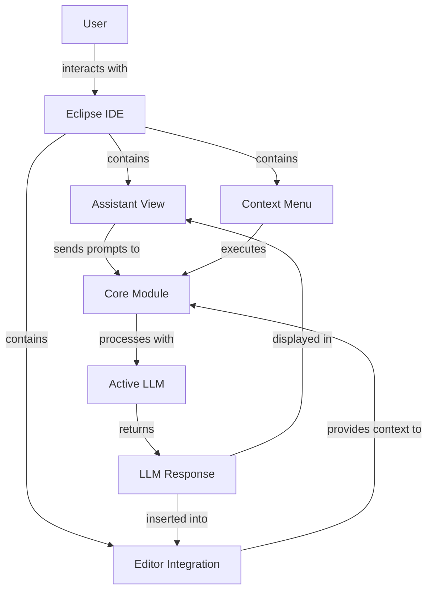
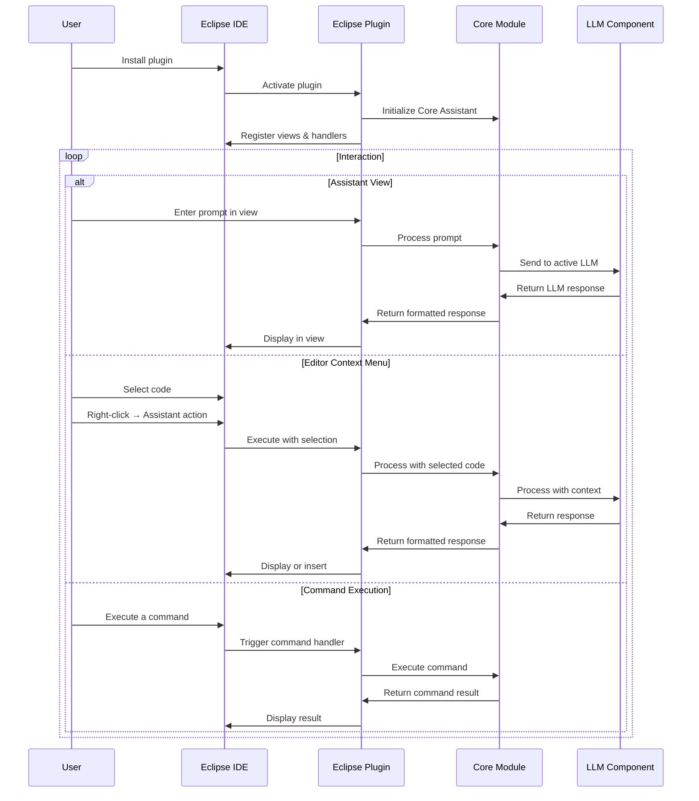
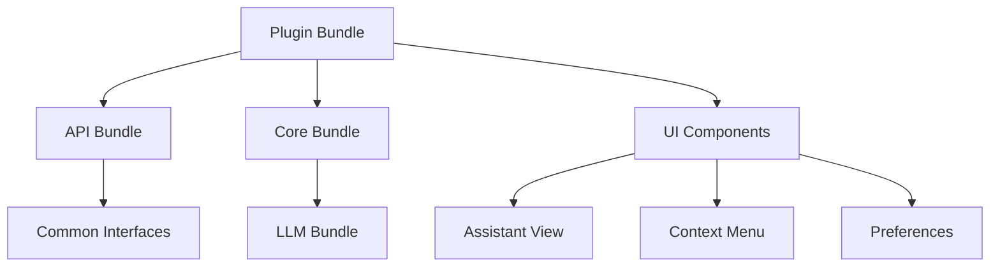
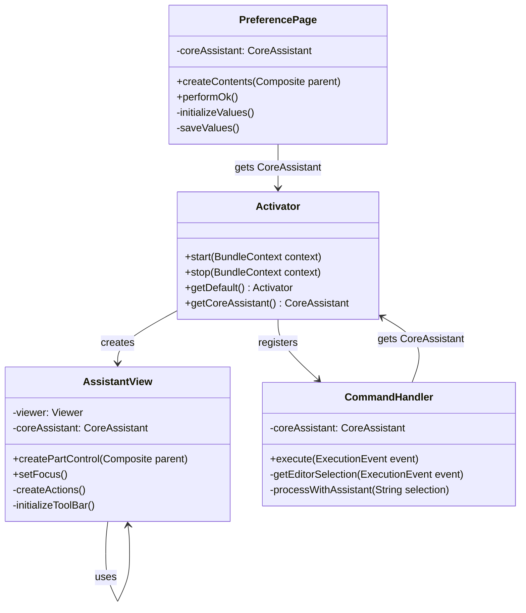

# Eclipse Plugin Module

The Eclipse Plugin module integrates Manorrock Assistant into the Eclipse IDE, enabling developers to leverage LLM capabilities directly within their Eclipse development environment.

## Overview

The Eclipse Plugin module:
- Adds Manorrock Assistant functionality to Eclipse IDE
- Provides a dedicated view for interacting with LLMs
- Enables context-aware assistance using editor selections
- Supports code generation and explanation within Eclipse
- Maintains consistent command structure with other Manorrock Assistant interfaces



## Key Components

### Assistant View

The primary interface component:
- Chat history displaying conversations with the assistant
- Input field for entering prompts and commands
- Context display showing current selection or file
- LLM configuration and status indicators

### Context Menu Integration

Extension features accessible through Eclipse context menus:
- Right-click on code selections to access assistant functions
- Options for code explanation, generation, and optimization
- Ability to add files or selections as context

### Editor Integration

Tight integration with the Eclipse editor:
- Code completion suggestions
- Quick-fix proposals for errors
- Documentation generation
- Code analysis and improvement suggestions

## Usage Workflow



## Installation

### From Eclipse Marketplace

1. In Eclipse, go to Help → Eclipse Marketplace
2. Search for "Manorrock Assistant"
3. Click "Install" and follow the prompts
4. Restart Eclipse when prompted

### Manual Installation

For development or offline installation:

1. Download the update site ZIP from [GitHub releases](https://github.com/manorrock/assistant/releases/latest)
2. In Eclipse, go to Help → Install New Software
3. Click "Add..." then "Archive..."
4. Browse to the downloaded ZIP file
5. Select Manorrock Assistant from the list and complete installation
6. Restart Eclipse

## Features

### Code Assistance

The plugin provides AI-powered code assistance:
- Code generation based on comments or requirements
- Method implementation suggestions
- Test case generation
- Refactoring recommendations

### Code Understanding

Helps developers understand existing code:
- Explanation of selected code blocks
- Documentation generation
- Architectural overview generation
- Dependency analysis

### Problem Solving

Assists with resolving development issues:
- Error explanation and fix suggestions
- Performance bottleneck identification
- Security vulnerability detection
- Best practice recommendations

### Documentation

Generates documentation for various elements:
- JavaDoc comments
- README content
- API usage examples
- Code walkthrough documentation

## Configuration

### Plugin Preferences

Accessible through Eclipse Preferences (Window → Preferences → Manorrock Assistant):

- **LLM Provider**: Select which LLM to use (Ollama, OpenAI, Azure)
- **API Key**: Set API key for cloud LLMs
- **Endpoint URL**: Configure API endpoint
- **Model**: Select model name to use
- **Temperature**: Adjust response randomness
- **System Message**: Configure default system message
- **Function Calling**: Enable/disable tool integration

### Keybindings

Default keyboard shortcuts:
- `Alt+A`: Open assistant view
- `Alt+E`: Explain selected code
- `Alt+G`: Generate code based on comment
- `Alt+T`: Generate test for selected method

## User Interface

### Assistant View

```
┌─────────────────────────────────────────────────┐
│ Manorrock Assistant                       [⚙️]  │
├─────────────────────────────────────────────────┤
│ ┌─────────────────────────────────────────────┐ │
│ │                                             │ │
│ │              Conversation History           │ │
│ │                                             │ │
│ │                                             │ │
│ │                                             │ │
│ └─────────────────────────────────────────────┘ │
│                                                 │
│ Context: MainClass.java (method calculate())    │
│                                                 │
│ ┌─────────────────────────────────────────────┐ │
│ │ Type a prompt...                      [Send] │ │
│ └─────────────────────────────────────────────┘ │
│                                                 │
│ LLM: llama3.2 @ http://localhost:11434         │
└─────────────────────────────────────────────────┘
```

### Context Menu

When right-clicking on code in the editor:

```
┌───────────────────────────────┐
│ Cut                           │
│ Copy                          │
│ Paste                         │
├───────────────────────────────┤
│ Refactor                      │ ▶
│ Source                        │ ▶
│ Manorrock Assistant           │ ▶ ┌──────────────────────┐
│                               │   │ Explain Selection    │
│                               │   │ Generate Tests       │
│                               │   │ Optimize Code        │
│                               │   │ Find Issues          │
│                               │   │ Document             │
│                               │   │ Ask About Selection  │
└───────────────────────────────┘   └──────────────────────┘
```

## OSGi Implementation

The Eclipse plugin uses OSGi for modular architecture:



## Development

### Project Structure

The Eclipse plugin follows standard Eclipse plugin structure:

```
eclipse/
  ├── plugin.xml         # Plugin declaration
  ├── META-INF/
  │   └── MANIFEST.MF    # OSGi manifest
  ├── build.properties   # Build configuration
  ├── lib/               # Dependencies
  └── src/
      └── com/manorrock/assistant/eclipse/
          ├── Activator.java         # Plugin activator
          ├── views/                 # UI views
          ├── handlers/              # Command handlers
          ├── preferences/           # Preference pages
          └── util/                  # Utility classes
```

### Building and Testing

To build the plugin from source:

```bash
cd eclipse
mvn clean package
```

This will generate an update site in the `target/repository` directory.

For testing during development:
1. Import the project into Eclipse PDE
2. Launch using "Eclipse Application" run configuration

### Architecture Details



## Integration with Java Development Tools (JDT)

The plugin integrates with Eclipse's Java Development Tools:
- Uses Java AST for better code understanding
- Integrates with JDT's code completion system
- Leverages JDT's problem markers for intelligent suggestions
- Extends JDT's quick fix proposals with AI-powered solutions

## Platform Support

The plugin supports various Eclipse distributions:
- Eclipse IDE for Java Developers
- Eclipse IDE for Enterprise Java Developers
- Eclipse for RCP and RAP Developers
- Other Eclipse-based IDEs with compatible version

Compatible with Eclipse versions 2021-03 (4.19) and newer.

## Troubleshooting

### Common Issues

1. **Missing Dependencies**: Ensure all required bundles are installed
2. **Connection Issues**: Check LLM server connectivity
3. **Memory Limitations**: Eclipse may need increased memory for large models
4. **Compatibility**: Verify Eclipse version compatibility

### Error Logging

View logs in Eclipse:
1. Window → Show View → Error Log
2. Filter for entries containing "manorrock"

### Diagnostic Mode

Enable additional logging:
1. Open Eclipse with `-debug` and `-console` parameters
2. In the OSGi console, enter: `setprop manorrock.assistant.debug true`
3. Enhanced logging will appear in the Error Log view
