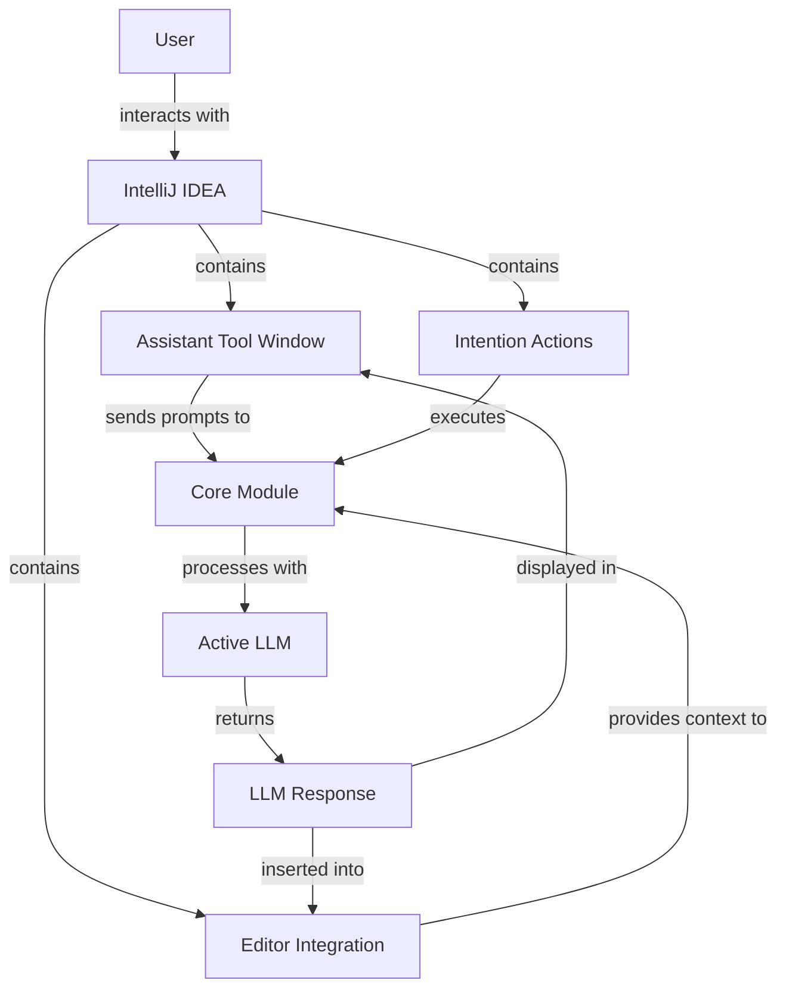
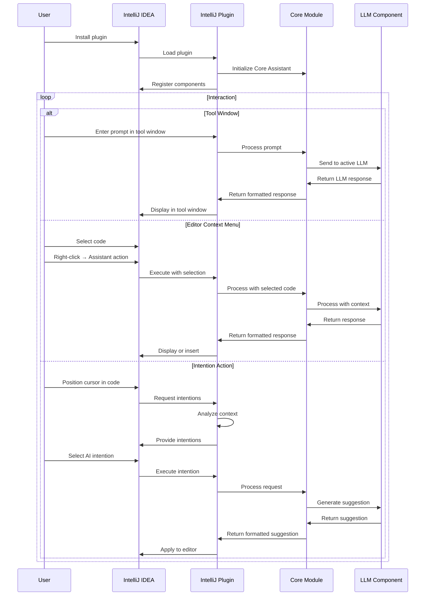
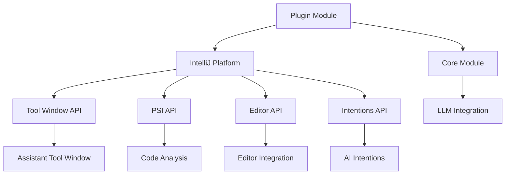
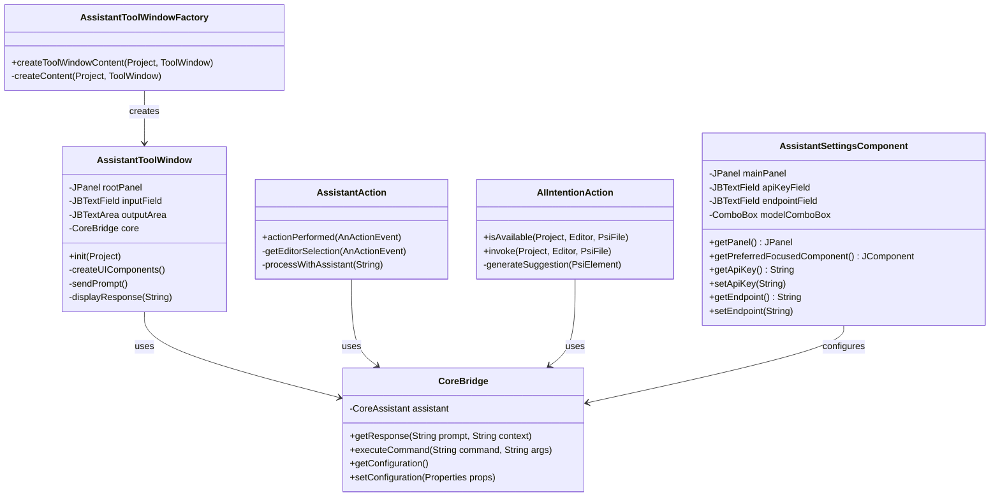

# IntelliJ IDEA Plugin Module

The IntelliJ IDEA Plugin module integrates Manorrock Assistant into JetBrains IntelliJ IDEA and other JetBrains IDEs, providing developers with AI-powered assistance directly within their development environment.

## Overview

The IntelliJ IDEA Plugin module:
- Embeds Manorrock Assistant capabilities into IntelliJ IDEA
- Provides a dedicated tool window for interactions
- Enables context-aware AI assistance using editor selections
- Supports code generation, explanation, and improvement
- Maintains consistent command structure with other Manorrock Assistant interfaces



## Key Components

### Assistant Tool Window

The main interface component:
- Chat history with the assistant
- Input area for entering prompts and commands
- Context display showing current selection or file
- LLM configuration and status indicators

### Intention Actions

Integration with IntelliJ's intention action system:
- AI-powered code suggestions appear in the editor
- Quick fixes and improvements based on context
- Code generation options

### Editor Integration

Tight integration with the IntelliJ editor:
- Code completion assistance
- Context menu actions
- Live templates
- Documentation generation

## Usage Workflow



## Installation

### From JetBrains Marketplace

1. In IntelliJ IDEA, go to File → Settings → Plugins
2. Select the "Marketplace" tab
3. Search for "Manorrock Assistant"
4. Click "Install" and restart IDE when prompted

### Manual Installation

For development or offline installation:

1. Download the plugin ZIP from [GitHub releases](https://github.com/manorrock/assistant/releases/latest)
2. In IntelliJ IDEA, go to File → Settings → Plugins
3. Click the gear icon and select "Install Plugin from Disk..."
4. Browse to the downloaded ZIP file
5. Restart IDE when prompted

## Features

### Code Assistance

AI-powered assistance for developers:
- Code generation from comments
- Method implementation suggestions
- Test case generation
- Refactoring recommendations

### Code Understanding

Helps developers understand existing code:
- Explanation of selected code blocks
- Documentation generation
- Design pattern identification
- Architecture visualization suggestions

### Problem Solving

Assists with development challenges:
- Error explanation and fix suggestions
- Performance optimization recommendations
- Security vulnerability detection
- Code quality improvements

### Documentation

Generates documentation for various elements:
- JavaDoc/KDoc/ScalaDoc comments
- README content
- API usage examples
- Code walkthrough documentation

## Configuration

### Plugin Settings

Accessible through IDE settings (File → Settings → Tools → Manorrock Assistant):

- **LLM Provider**: Select LLM provider (Ollama, OpenAI, Azure)
- **API Key**: Set API key for cloud LLMs
- **Endpoint URL**: Configure API endpoint
- **Model**: Select model name to use
- **Temperature**: Adjust response randomness
- **System Message**: Configure default system message
- **Function Calling**: Enable/disable tool integration
- **Max Tokens**: Set response length limit
- **Appearance**: Configure UI themes and font size

### Keyboard Shortcuts

Default keyboard shortcuts:
- `Alt+A` / `Option+A`: Open assistant tool window
- `Alt+E` / `Option+E`: Explain selected code
- `Alt+G` / `Option+G`: Generate code from comment
- `Alt+T` / `Option+T`: Generate test for selected method

## User Interface

### Assistant Tool Window

```
┌─────────────────────────────────────────────────┐
│ Manorrock Assistant                        [⚙️] │
├─────────────────────────────────────────────────┤
│ ┌─────────────────────────────────────────────┐ │
│ │                                             │ │
│ │             Conversation History            │ │
│ │                                             │ │
│ │                                             │ │
│ │                                             │ │
│ └─────────────────────────────────────────────┘ │
│                                                 │
│ Context: UserService.java (method authenticate) │
│                                                 │
│ ┌─────────────────────────────────────────────┐ │
│ │ Ask a question...                    [Send]  │ │
│ └─────────────────────────────────────────────┘ │
│                                                 │
│ LLM: llama3.2 @ http://localhost:11434         │
└─────────────────────────────────────────────────┘
```

### Context Menu

When right-clicking on code in the editor:

```
┌─────────────────────────────┐
│ Generate Code               │ ▶
│ Analyze Code                │ ▶
│ Refactor                    │ ▶
│ Manorrock Assistant         │ ▶ ┌────────────────────┐
│                             │   │ Explain Code       │
│                             │   │ Generate Tests     │
│                             │   │ Improve Code       │
│                             │   │ Generate Comments  │
│                             │   │ Find Issues        │
│                             │   │ Ask About Code     │
└─────────────────────────────┘   └────────────────────┘
```

### Intention Actions

When cursor is positioned in code:

```
┌────────────────────────────────────┐
│ 💡 Generate documentation comment   │
│ 💡 Convert to stream pipeline       │
│ 💡 Optimize imports                 │
│ 💡 AI: Rewrite for better readability │
│ 💡 AI: Generate unit test           │
│ 💡 AI: Fix potential issues         │
└────────────────────────────────────┘
```

## IntelliJ Platform Integration

The plugin uses the IntelliJ Platform SDK for deep IDE integration:



## Development

### Project Structure

The IntelliJ plugin uses Gradle as its build system:

```
intellij/
  ├── build.gradle.kts          # Gradle build script
  ├── gradle.properties         # Gradle properties
  ├── settings.gradle.kts       # Gradle settings
  ├── src/
  │   └── main/
  │       ├── java/             # Java source code
  │       │   └── com/manorrock/assistant/intellij/
  │       │       ├── AssistantToolWindowFactory.java
  │       │       ├── AssistantAction.java
  │       │       ├── CoreBridge.java
  │       │       ├── intentions/
  │       │       ├── settings/
  │       │       └── utils/
  │       ├── kotlin/           # Kotlin source code (if used)
  │       └── resources/
  │           ├── META-INF/
  │           │   └── plugin.xml      # Plugin configuration
  │           └── icons/              # Plugin icons
  └── build/                    # Build output
```

### Building and Testing

To build the plugin from source:

```bash
cd intellij
./gradlew buildPlugin
```

This will generate a plugin ZIP file in the `build/distributions` directory.

For testing during development:
```bash
./gradlew runIde
```

### Architecture Details



## JetBrains Platform Support

The plugin supports multiple JetBrains IDEs:
- IntelliJ IDEA (Community and Ultimate)
- PyCharm
- WebStorm
- PhpStorm
- Rider
- CLion
- Android Studio
- Other compatible JetBrains IDEs

Compatible with IntelliJ Platform version 2021.3 and newer.

## Troubleshooting

### Common Issues

1. **Plugin Loading**: If the plugin fails to load, check the IDE log for errors
2. **LLM Connection**: Ensure Ollama is running for local models or check internet connectivity for cloud models
3. **Memory Issues**: For large models, increase IDE heap size (Help → Change Memory Settings)
4. **Platform Compatibility**: Verify IntelliJ platform version compatibility

### Log Files

Access IDE logs:
1. Help → Show Log in Explorer/Finder/Files

### Debug Mode

Enable additional logging:
1. Help → Diagnostic Tools → Debug Log Settings
2. Add "#com.manorrock.assistant" to enable detailed logging
3. Restart the IDE
4. Check the log file for detailed diagnostic information
