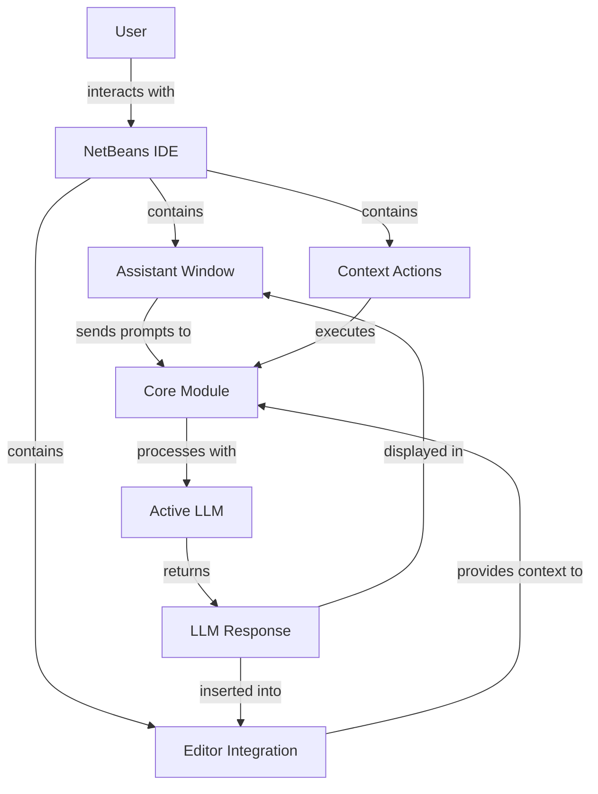
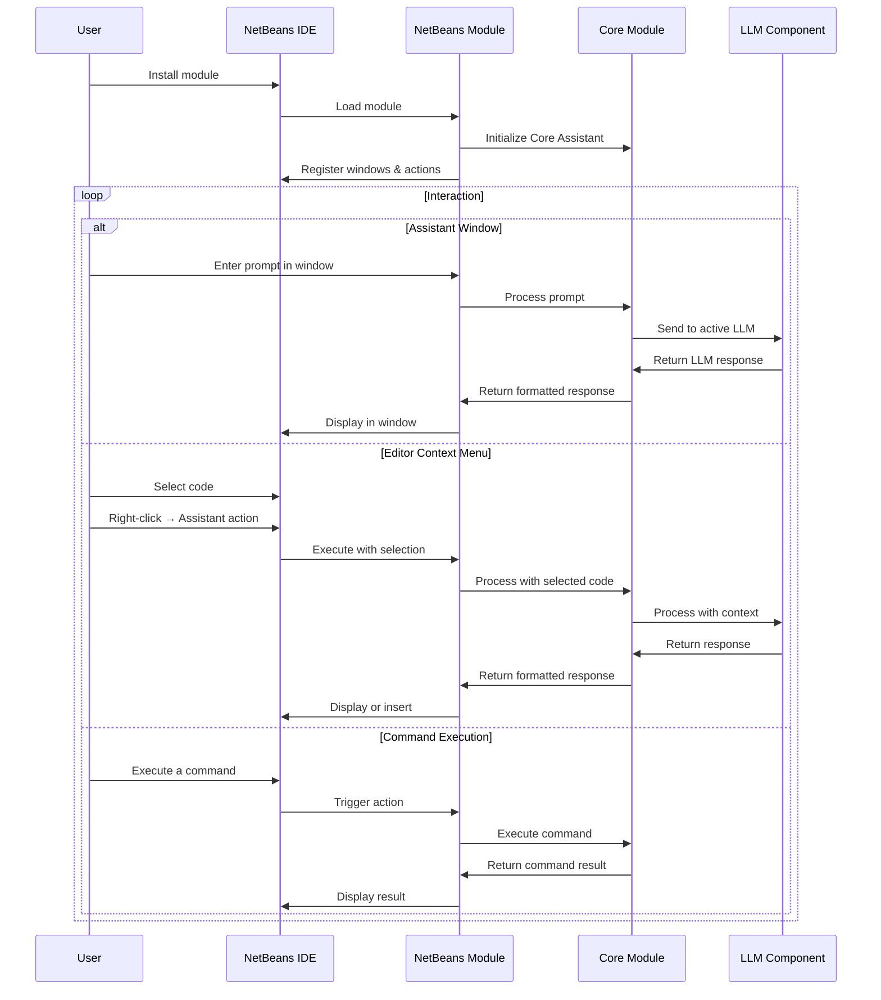
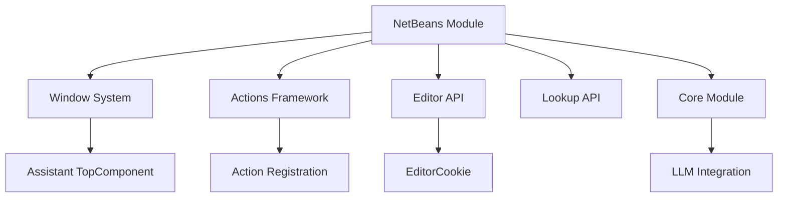
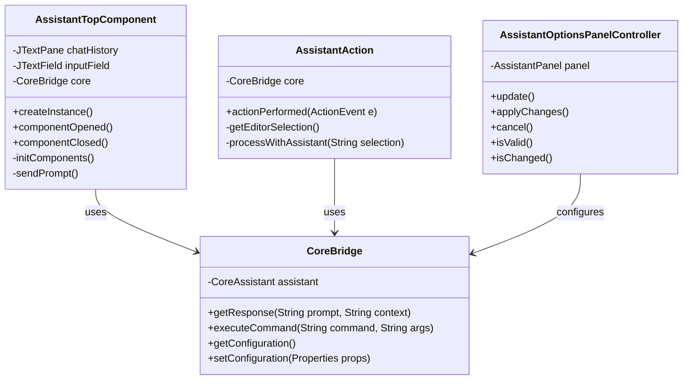

# NetBeans Module

The NetBeans Module integrates Manorrock Assistant into the Apache NetBeans IDE, providing developers with direct access to LLM capabilities within their development environment.

## Overview

The NetBeans Module:
- Embeds Manorrock Assistant into the NetBeans IDE
- Provides a dedicated window for interacting with LLMs
- Enables context-sensitive assistance using editor selections
- Supports code generation and explanation
- Maintains consistent command structure with other Manorrock Assistant interfaces



## Key Components

### Assistant Window

The main interface component in NetBeans:
- Chat history showing conversations with the assistant
- Input area for entering prompts and commands
- Context display showing current selection or file
- LLM configuration and status indicators

### Context Actions

Integration with NetBeans context menus:
- Right-click actions for code selections
- Code popup menu entries for assistant functions
- Project explorer integration

### Editor Integration

Tight integration with the NetBeans editor:
- Code generation capabilities
- Documentation assistance
- Error explanation and fixes
- Code analysis and suggestions

## Usage Workflow



## Installation

### From NetBeans Plugin Portal

1. In NetBeans, go to Tools → Plugins
2. Select the "Available Plugins" tab
3. Search for "Manorrock Assistant"
4. Check the plugin and click "Install"
5. Complete the installation wizard and restart NetBeans

### Manual Installation

For development or offline installation:

1. Download the NBM file from [GitHub releases](https://github.com/manorrock/assistant/releases/latest)
2. In NetBeans, go to Tools → Plugins
3. Select the "Downloaded" tab
4. Click "Add Plugins..." and browse to the NBM file
5. Complete the installation and restart NetBeans

## Features

### Code Assistance

AI-powered assistance for developers:
- Code generation based on comments
- Method implementation suggestions
- Test case generation
- Refactoring recommendations

### Code Understanding

Helps developers understand existing code:
- Explanation of selected code
- Documentation generation
- Design pattern identification
- Dependency analysis

### Problem Solving

Assists with development challenges:
- Error explanation and fix suggestions
- Performance optimization recommendations
- Security vulnerability detection
- Code quality improvements

### Documentation

Generates documentation for various elements:
- JavaDoc comments
- README content
- API usage examples
- Code walkthrough documentation

## Configuration

### Module Options

Accessible through NetBeans Options dialog (Tools → Options → Manorrock Assistant):

- **LLM Provider**: Select LLM provider (Ollama, OpenAI, Azure)
- **API Key**: Set API key for cloud LLMs
- **Endpoint URL**: Configure API endpoint
- **Model**: Select model name to use
- **Temperature**: Adjust response randomness
- **System Message**: Configure default system message
- **Function Calling**: Enable/disable tool integration

### Keyboard Shortcuts

Default keyboard shortcuts:
- `Ctrl+Shift+A`: Open assistant window
- `Ctrl+Shift+E`: Explain selected code
- `Ctrl+Shift+G`: Generate code from comment
- `Ctrl+Shift+T`: Generate test for selected method

## User Interface

### Assistant Window

```
┌─────────────────────────────────────────────────┐
│ Manorrock Assistant                        [⚙️] │
├─────────────────────────────────────────────────┤
│ ┌─────────────────────────────────────────────┐ │
│ │                                             │ │
│ │             Conversation History            │ │
│ │                                             │ │
│ │                                             │ │
│ │                                             │ │
│ └─────────────────────────────────────────────┘ │
│                                                 │
│ Context: Customer.java (method processOrder())  │
│                                                 │
│ ┌─────────────────────────────────────────────┐ │
│ │ Type a prompt...                     [Send]  │ │
│ └─────────────────────────────────────────────┘ │
│                                                 │
│ LLM: llama3.2 @ http://localhost:11434         │
└─────────────────────────────────────────────────┘
```

### Context Menu

When right-clicking on code in the editor:

```
┌─────────────────────────────┐
│ Cut                         │
│ Copy                        │
│ Paste                       │
├─────────────────────────────┤
│ Refactor                    │ ▶
│ Source                      │ ▶
│ Manorrock Assistant         │ ▶ ┌────────────────────┐
│                             │   │ Explain Code       │
│                             │   │ Generate Tests     │
│                             │   │ Optimize Code      │
│                             │   │ Generate JavaDoc   │
│                             │   │ Find Issues        │
│                             │   │ Ask About Code     │
└─────────────────────────────┘   └────────────────────┘
```

## NetBeans Module System

The module leverages the NetBeans Module System for integration:



## Development

### Project Structure

The NetBeans module follows standard NetBeans module structure:

```
netbeans/
  ├── pom.xml                  # Maven build file
  ├── src/
  │   └── main/
  │       ├── java/
  │       │   └── com/manorrock/assistant/netbeans/
  │       │       ├── AssistantTopComponent.java
  │       │       ├── AssistantAction.java
  │       │       ├── CoreBridge.java
  │       │       └── options/
  │       │           └── AssistantPanel.java
  │       ├── resources/
  │       │   └── com/manorrock/assistant/netbeans/
  │       │       └── Bundle.properties
  │       └── nbm/
  │           └── manifest.mf  # NetBeans module manifest
  └── target/                  # Build output
```

### Building and Testing

To build the module from source:

```bash
cd netbeans
mvn clean package
```

This will generate an NBM file in the `target` directory.

For testing during development:
1. Open the project in NetBeans
2. Run the project (F6) to launch a development instance of NetBeans with the plugin installed

### Architecture Details



## Integration with NetBeans APIs

The module integrates with several NetBeans APIs:

- **Window System**: Provides the assistant window through the TopComponent API
- **Editor Library**: Accesses editor contents and selections
- **Nodes API**: Interacts with project structure
- **Actions Framework**: Registers context menu actions
- **Options API**: Creates configuration options panel

## Platform Support

The module supports:
- NetBeans 12.0 and newer
- Apache NetBeans IDE 12.0 and newer
- Compatible with Java, PHP, C/C++, and other NetBeans development environments

## Troubleshooting

### Common Issues

1. **Module Loading**: If the module doesn't load, check the NetBeans log for errors
2. **LLM Connection**: Ensure Ollama is running for local models or check internet connectivity for cloud models
3. **Memory Issues**: For large models, increase NetBeans heap size (netbeans_default_options="-J-Xms64m -J-Xmx2048m" in netbeans.conf)

### Logging

View NetBeans logs:
1. Help → About → View Details → Important Files → View IDE Log

### Debug Mode

Enable additional logging:
1. Edit netbeans.conf and add: `-J-Dmanorrock.assistant.debug=true`
2. Restart NetBeans
3. Check the IDE log for detailed diagnostic information
