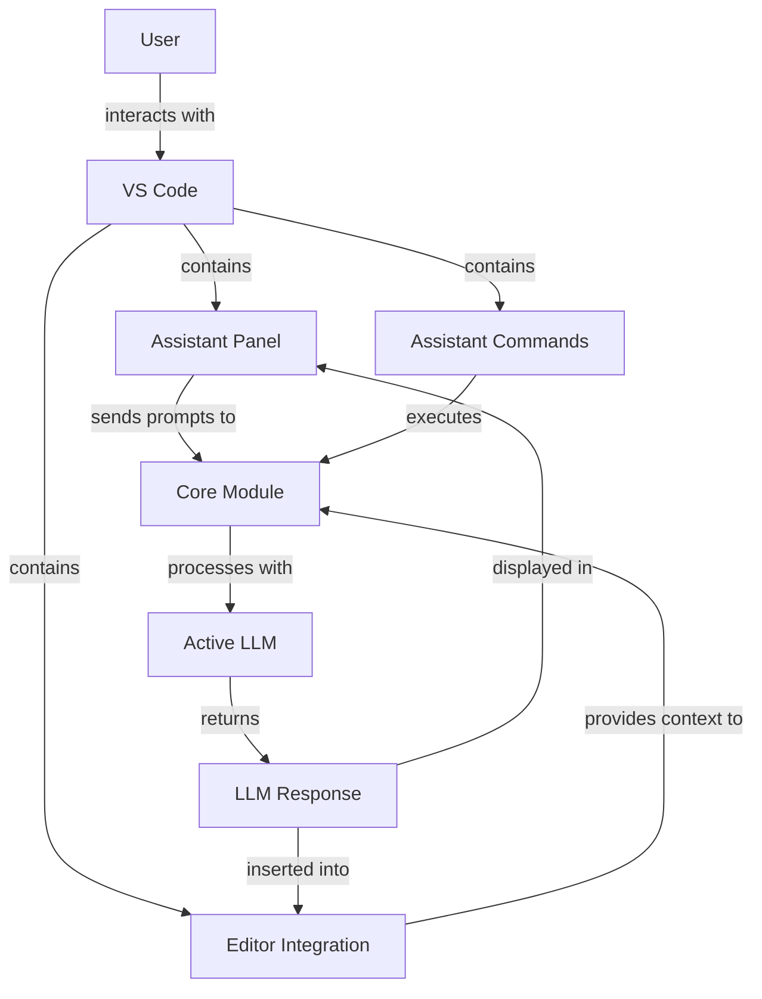
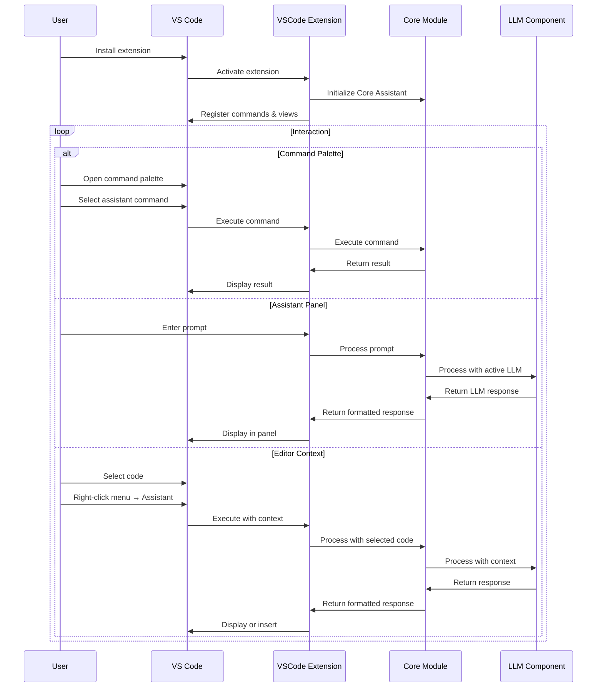
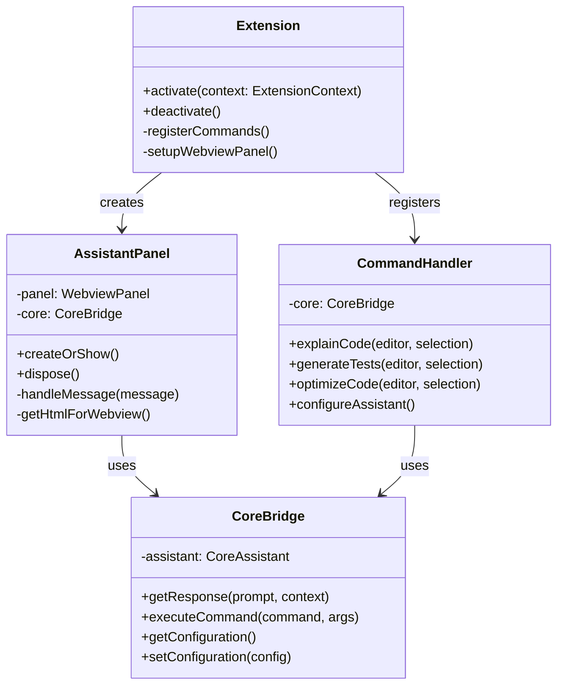

# VSCode Extension Module

The VSCode Extension module provides integration of Manorrock Assistant into Visual Studio Code, allowing developers to access LLM capabilities directly within their coding environment.

## Overview

The VSCode Extension module:
- Integrates Manorrock Assistant into the Visual Studio Code IDE
- Provides a sidebar panel for interacting with LLMs
- Enables context-aware prompts using editor selections
- Supports code generation and explanation directly in the editor
- Maintains the same command structure as other interfaces for consistency



## Key Components

### Assistant Panel

The main interface component:
- Chat history with the assistant
- Input area for entering prompts and commands
- Context selector for adding code/files to prompts
- LLM status indicator

### Command Palette Integration

Extension commands are accessible through the VS Code Command Palette:
- Start new session
- Explain code selection
- Generate code
- Configure LLM settings
- Access context management

### Editor Integration

Tight integration with the VS Code editor:
- Right-click menu options for assistant actions
- Code lens providers for inline assistance
- Ability to insert code suggestions directly
- Selection-based context for smarter responses

## Usage Workflow



## Installation

### From VS Code Marketplace

1. Open VS Code
2. Go to the Extensions view (Ctrl+Shift+X / Cmd+Shift+X)
3. Search for "Manorrock Assistant"
4. Click "Install"

### Manual Installation

For development or testing:

1. Download the VSIX file from [GitHub releases](https://github.com/manorrock/assistant/releases/latest)
2. In VS Code, go to Extensions view
3. Click the "..." menu and select "Install from VSIX..."
4. Browse to the downloaded file and select it

## Features

### Code Context Integration

The extension can incorporate code context in various ways:
- Selected code in the editor
- Active file contents
- Project structure information
- Related files (e.g., test files for implementation files)

### Inline Code Actions

Code actions appear inline in the editor:
- Generate related code (e.g., tests for a function)
- Explain selected code
- Refactor or optimize code
- Fix errors or suggest improvements

### Code Completion

The extension can provide AI-powered code completions:
- Function implementations
- Comments and documentation
- Test cases
- Configuration files

### Documentation Generation

Automatically generate documentation:
- JSDoc/JavaDoc comments
- README files
- API documentation
- Usage examples

## Configuration

### Extension Settings

Accessible through VS Code settings (File > Preferences > Settings):

- **Manorrock Assistant: LLM Provider**: Select which LLM to use
- **Manorrock Assistant: API Key**: Set API key for cloud LLMs
- **Manorrock Assistant: Endpoint**: URL for LLM API endpoint
- **Manorrock Assistant: Show Status Bar**: Toggle status bar visibility
- **Manorrock Assistant: Auto-Context**: Automatically include relevant context

### Keybindings

Default keyboard shortcuts:
- `Ctrl+Shift+A` / `Cmd+Shift+A`: Open assistant panel
- `Ctrl+Shift+E` / `Cmd+Shift+E`: Explain selected code
- `Ctrl+Shift+G` / `Cmd+Shift+G`: Generate code based on comment

## User Interface

### Assistant Panel

```
┌─────────────────────────────────────────────────┐
│ MANORROCK ASSISTANT                       [...] │
├─────────────────────────────────────────────────┤
│ ┌─────────────────────────────────────────────┐ │
│ │                                             │ │
│ │             Conversation History            │ │
│ │                                             │ │
│ │                                             │ │
│ └─────────────────────────────────────────────┘ │
│                                                 │
│ Context: [Selected Text (20 lines)      ] [✓]   │
│                                                 │
│ ┌─────────────────────────────────────────────┐ │
│ │ Ask a question...                      [▶]  │ │
│ └─────────────────────────────────────────────┘ │
│                                                 │
│ Status: Using llama3.2 (local)                  │
└─────────────────────────────────────────────────┘
```

### Command Menu

When right-clicking selected code:

```
┌─────────────────────────────┐
│ Cut                         │
│ Copy                        │
│ Paste                       │
├─────────────────────────────┤
│ Manorrock Assistant         │ ▶ ┌───────────────────────┐
│                             │   │ Explain selection     │
│                             │   │ Generate tests        │
│                             │   │ Refactor code         │
│                             │   │ Optimize              │
│                             │   │ Find issues           │
│                             │   │ Document              │
│                             │   │ Ask about selection   │
└─────────────────────────────┘   └───────────────────────┘
```

## Development

### Project Structure

The VS Code extension follows the standard VS Code extension structure:

```
vscode/
  ├── package.json         # Extension manifest
  ├── extension.ts         # Extension activation point
  ├── src/
  │   ├── extension.ts     # Main extension code
  │   ├── panel.ts         # Assistant panel implementation
  │   ├── commands.ts      # Command implementations
  │   ├── config.ts        # Configuration handling
  │   └── bridge.ts        # Bridge to Core module
  └── resources/           # Icons and other resources
```

### Building and Testing

To build the extension from source:

```bash
cd vscode
npm install    # Install dependencies
npm run build  # Compile TypeScript
```

For testing:

```bash
npm run test   # Run tests
```

To package the extension:

```bash
npm run package  # Creates a .vsix file
```

### Architecture Details



## Integration with Language Servers

The extension integrates with VS Code's language servers:
- Uses language server diagnostics to identify code issues
- Can suggest fixes for problems detected by language servers
- Leverages language server semantic information for more accurate context

## Platform-Specific Features

The extension works across all platforms supported by VS Code:
- Windows, macOS, and Linux desktop environments
- VS Code for the Web (limited functionality)
- GitHub Codespaces and other remote development environments

## Troubleshooting

### Common Issues

1. **Connection to LLM**: Ensure local Ollama server is running or check internet connection for cloud LLMs
2. **Missing Context**: Some language features may require language server extensions to be installed
3. **Performance**: Large files or complex context might slow down response times

### Extension Logs

To access logs:
1. Open the Command Palette (Ctrl+Shift+P / Cmd+Shift+P)
2. Execute "Developer: Open Extension Logs"
3. Look for entries related to "manorrock-assistant"

### Diagnostic Mode

Enable diagnostic logging:
1. Open VS Code settings
2. Set "Manorrock Assistant: Diagnostic Mode" to true
3. Reopen the logs to see detailed information
